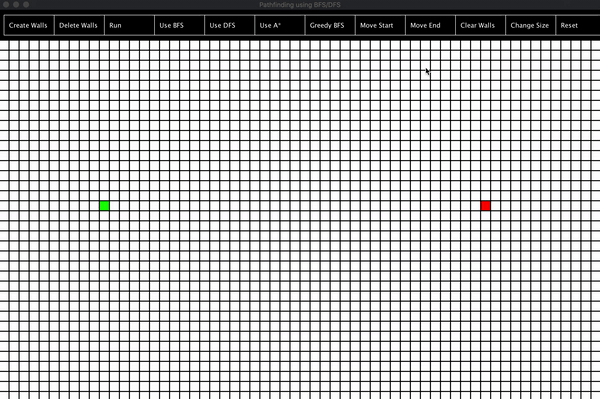
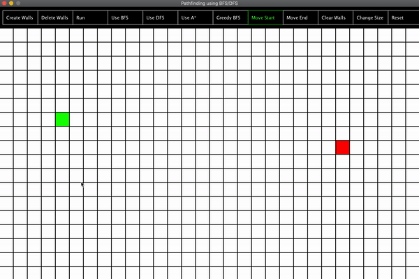

# Pathfinding-Visualization

This is a Pathfinding project that utilizes BFS,DFS,GreedyBFS, and A*.

The hotbar on the top of the screen allows for variety, and a chance for the algorithms to work in different ways. Some of the cool features on the top include creating/removing obstacles, changing the size of the grid, and resetting anything if something goes wrong.

You can also move the start and end nodes!

I found Breadth First search to be one of the more visually mesmerizing searching algorithms. Take a look below.

Here's another example. \n

The most fun searching algorithm to build was the A* pathfinding algorithm. It's still a little bit buggy(as I am still learning/working on improving the algorithm), but it also utilizes diagonals!

# What I learned:

BFS/DFS

Greedy/A* (somewhat)

Simple Gui with Java

Crude user interaction

